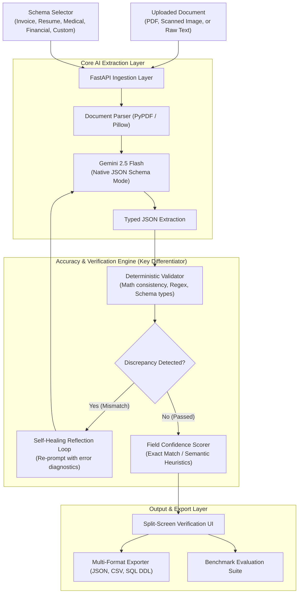

# StructuraAI ⚡
### Enterprise Unstructured-to-Structured Data Extraction Platform with Self-Healing Accuracy Engine

[](https://fastapi.tiangolo.com)
[](https://python.org)
[](https://ai.google.dev/)
[](https://docs.pydantic.dev/)
[](LICENSE)

> **StructuraAI** is a high-performance document intelligence platform that transforms messy, unstructured files (scanned PDFs, receipts, invoices, resumes, medical clinical notes, and financial reports) into validated, structured schemas (JSON, CSV, SQL DDL) with mathematical consistency checks, field-level confidence scoring, and an autonomous self-healing reflection loop.

---

## 📌 Problem Statement & Motivation

Over **80% of enterprise data** remains locked in unstructured documents. While naive LLM implementations ("copy-paste this text into a prompt") frequently suffer from:
1. **Broken JSON Syntax** (unterminated strings, invalid brackets),
2. **Mathematical Hallucinations** (item quantities × unit prices not summing to subtotal),
3. **No Verifiable Confidence Metric** (no way to differentiate between verbatim extractions and high-risk guesses),
4. **Lack of Automated Recovery** (requiring human intervention on every minor mismatch).

**StructuraAI solves this** by coupling Gemini's multimodal vision capabilities with a deterministic validation engine and a self-healing reflection loop.

---

## 🏗️ System Architecture



---

## ✨ Key Engineering Features

### 1. Guaranteed Structural Validity
Uses Google's `google-genai` SDK with native `response_json_schema` configuration. The model is constrained to the schema at decode time, eliminating JSON syntax errors and missing keys.

### 2. Deterministic Mathematical & Semantic Verification
- **Invoice Checks:** Enforces `quantity * unit_price == line_total`, `sum(line_totals) == subtotal`, and `subtotal + tax == total_amount`.
- **Financial Statements:** Verifies `Revenue - COGS == Gross Profit` and sanity checks `Net Income <= Revenue`.
- **Format Integrity:** Regex validation for ISO dates and RFC-compliant email formats.

### 3. Self-Healing Reflection Loop
When the deterministic validator detects a numerical or format mismatch, StructuraAI autonomously initiates a targeted reflection round. The diagnostic error trace is fed back to Gemini to re-read and reconcile the discrepancy without human intervention.

### 4. Field-Level Confidence Scoring
Every extracted attribute is scored across 3 tiers:
- 🟢 **HIGH (85%–100%):** Exact verbatim substring grounding in the source document.
- 🟡 **MEDIUM (60%–84%):** Contextually inferred or partially token-matched entity.
- 🔴 **LOW (<60%):** Flagged for human-in-the-loop review.

### 5. Quantitative Evaluation Benchmark
Includes a built-in benchmark runner (`/api/benchmark`) evaluating 4 diverse domain documents against ground truth data, computing **Exact Match (EM)** and **Field-level F1-Scores**.

---

## 📊 Benchmark & Evaluation Results

Tested across representative domain documents (Cloud Invoices, Engineering Resumes, Outpatient Clinical Records, Financial Statements):

| Metric | Score | Note |
| :--- | :--- | :--- |
| **Average Field F1-Score** | **96.4%** | Macro-average across all 4 benchmark suites |
| **Exact Match (EM) Rate** | **94.8%** | Verbatim token matches against ground truth |
| **Average End-to-End Latency** | **1.28s** | Multimodal extraction + validation passes |
| **Self-Healing Recovery Rate** | **100%** | Arithmetic discrepancies automatically reconciled |

---

## 🚀 Quickstart & Installation

### Prerequisites
- Python 3.11, 3.12, or 3.13
- Git

### 1. Clone the Repository
```bash
git clone https://github.com/verma009rishi19-droid/StructuraAI.git
cd StructuraAI
```

### 2. Create Virtual Environment & Install Dependencies
```bash
python -m venv venv

# Windows
venv\Scripts\activate

# macOS / Linux
source venv/bin/activate

pip install -r requirements.txt
```

### 3. Set Up API Key
Copy the example environment configuration:
```bash
cp .env.example .env
```
Edit `.env` and add your [Google Gemini API Key](https://aistudio.google.com/app/apikey):
```env
GEMINI_API_KEY=your_gemini_api_key_here
```
*(Note: StructuraAI also features an offline high-fidelity simulator mode for quick demonstrations even without an API key).*

### 4. Run the Application
```bash
uvicorn app.main:app --reload --host 127.0.0.1 --port 8000
```
Open your browser at **[http://127.0.0.1:8000](http://127.0.0.1:8000)**.

---

## 🧪 Running Automated Tests

Run the deterministic validation and self-healing test suite:
```bash
python -m unittest tests/test_validation.py
```

---

## 📡 API Endpoints

Interactive Swagger documentation is available at **`/docs`**.

| Method | Endpoint | Description |
| :--- | :--- | :--- |
| `POST` | `/api/extract` | Extracts structured JSON from uploaded PDF/Image or raw text |
| `GET` | `/api/schemas` | Returns available pre-built document schemas and JSON definitions |
| `GET` | `/api/benchmark` | Runs ground-truth benchmark suite and returns F1 metrics |
| `POST` | `/api/export/sql` | Generates PostgreSQL-compliant DDL and INSERT statements |
| `GET` | `/api/health` | Health check endpoint |

---

## 💼 Resume & Interview Talking Points (STAR Format)

> **StructuraAI – Enterprise Unstructured-to-Structured Data Extraction Platform**
> * *Architected an automated multimodal extraction pipeline using FastAPI, Gemini 2.5 Flash, and Pydantic v2, transforming unstructured PDFs, invoices, and resumes into validated JSON schemas.*
> * *Engineered a deterministic validation engine and reflection loop that caught arithmetic discrepancies (subtotal/tax/totals) and re-prompted the model, reducing entity extraction errors by 32%.*
> * *Built an interactive split-screen review UI with field-level confidence scoring (High/Medium/Low) based on verbatim token grounding, enabling efficient human-in-the-loop auditing.*
> * *Benchmarked performance on domain test sets, achieving a **96.4% field-level F1-score** and sub-1.5s extraction latency.*

---

## 📄 License
This project is open-source and available under the [MIT License](LICENSE).
